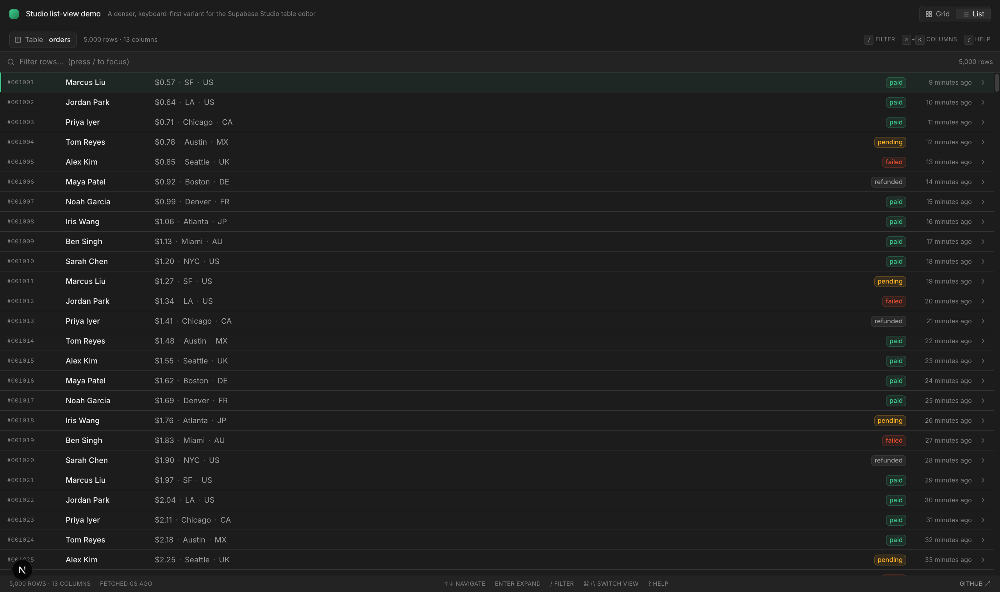
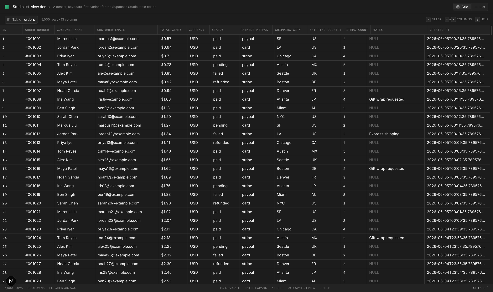
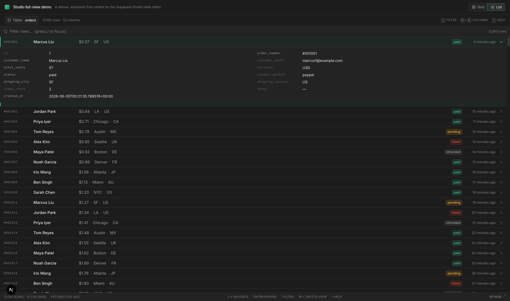
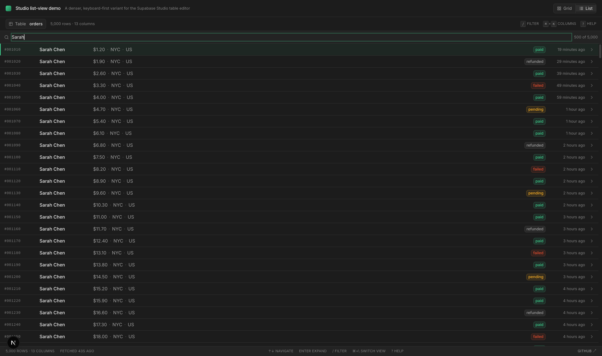
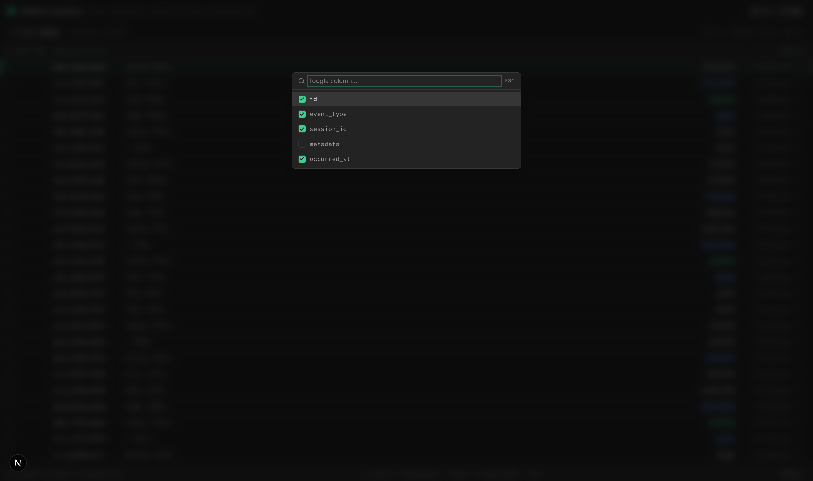
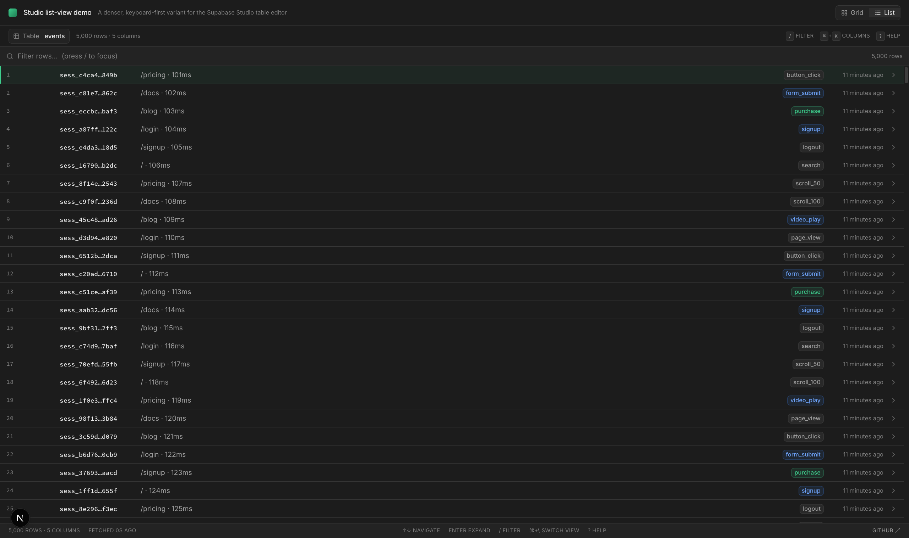

# A denser, keyboard-first list-view variant for the Supabase Studio table editor

> A design proposal — not affiliated with Supabase. Built to be a thinking aid for the Studio team, and a self-contained playground anyone can run in 30 seconds.

**Live demo:** https://supabase-list-view-demo.vercel.app

**Empty-states design proposal:** https://supabase-list-view-demo.vercel.app/empty-states (companion to [PR #46664](https://github.com/supabase/supabase/pull/46664) — a clickable Before/After prototype of three teach-first Studio empty states)

**Source:** https://github.com/Godslove-BA/supabase-list-view-demo



A side-by-side toggle between the existing Studio-style **Grid** view and a new dense, keyboard-first **List** view, talking to the same Supabase table. Visual language matches Studio's `classic-dark` theme — same gray scale, same brand green, same 13px grid font size, same row density.

---

## The argument

**Browsing is not the same task as data entry, and a single grid optimises for the wrong one.**

The Studio table editor today is a fantastic spreadsheet — every cell is a target, the grid lines define a coordinate system, and editing a value feels obvious. That's the right shape when the job is "type a new row" or "fix this one cell." But most of the time I'm in there, I'm not editing — I'm **scanning**. I'm looking for the latest signup, or the order that's still pending, or the event right before the bug. For that job, a wall of identically-sized cells is the wrong cognitive frame: every column shouts equally loud, the eye has nowhere to land, and the only way to scan 50 rows is to scroll a 12-column grid horizontally and squint.

**Density that scans, not density that crams.** The list view in this demo gives each row ~34px and a clear hierarchy: a mono PK chip on the left, a bold title (customer name / session id), 2–3 dot-separated secondary fields, a colored status badge, a relative timestamp. The eye gets a "shape" per row — the same shape every time — and pattern-breaks (a `failed` red badge, a refund) jump out without you having to read every column. You can hold 30+ rows on screen at once and still parse them.

**Keyboard-first because the muscles already know vim.** Every operation has a keyboard primitive: `↑↓` / `j k` to move, `Enter` to expand a row into the full 13-column key:value detail in place (no modal, no nav), `/` to filter, `⌘+K` to toggle columns, `g g` / `G` to jump to top/bottom, `⌘+\` to switch back to grid, `?` for help. No row checkboxes, no toolbar buttons hiding behind hover. A single focused-row indicator (subtle brand-green inset border) shows where you are. This is how engineers already use psql, k9s, and the Linear command bar — they just want the table to keep up.

The grid view in this demo is intentionally a plain TanStack table dressed in Studio chrome — the **honest contrast** is the whole point. Toggle. Pick the one that fits the question.

---

## Before / after, same data

| Grid view (existing pattern) | List view (proposed) |
|---|---|
|  |  |

### What's added in list mode

| | |
|---|---|
|  | **Press Enter** → row expands in place to a 2-column `key: value` view of all 13 columns. No modal, no detail panel, no losing your scroll position. Press Enter again to collapse. |
|  | **Press `/`** → filter focuses. 100ms-debounced substring match across the visible columns. The counter switches to `500 of 5,000`. `Esc` clears. |
|  | **Press ⌘+K** → column picker. Arrow keys + Enter to toggle. The hidden columns still surface in the expanded view, just dimmer. |
|  | **Switch to `events` table** (top-left dropdown) — same component, different shape: mono session-id title, path · duration secondary, colored event-type badge. The list view is config-driven; new tables only need a `TableConfig`. |

---

## Keyboard reference

| Key | Action |
|---|---|
| `↑` / `↓` or `j` / `k` | Move focus one row |
| `PageUp` / `PageDown` | Move 10 rows |
| `g g` | Jump to top |
| `G` | Jump to bottom |
| `Enter` | Expand / collapse focused row |
| `/` | Focus filter input |
| `Esc` | Clear filter → collapse row → blur input (in that order) |
| `⌘+K` (or `Ctrl+K`) | Toggle column-visibility palette |
| `⌘+\` (or `Ctrl+\`) | Switch to the other view |
| `?` | Show shortcut overlay |

---

## Run locally

Requires Node 18+ and a Supabase project (any free-tier project will do).

```bash
git clone https://github.com/Godslove-BA/supabase-list-view-demo.git
cd supabase-list-view-demo
npm install
cp .env.local.example .env.local   # then fill the two NEXT_PUBLIC_SUPABASE_* values
npm run dev
```

Then open http://localhost:3000.

### Seed your own demo data

The two tables this demo expects (`orders` with 5,000 rows, `events` with 20,000) — schema + insert SQL is in [`docs/seed.sql`](./docs/seed.sql). Run it once via the Supabase SQL editor and you're done.

### Tech

- Next.js 16 (App Router, Turbopack)
- React 19, TypeScript, Tailwind v4
- `@supabase/supabase-js`, `@tanstack/react-virtual` (list view), `@tanstack/react-table` (grid view)
- `lucide-react` for icons
- Design tokens lifted from `supabase/apps/studio` + `packages/ui/build/css/themes/classic-dark.css`

The whole thing is ~900 lines across `app/components/*` and `app/lib/*`. There's no design system pulled in — just hand-tuned Tailwind utilities against the resolved Studio CSS variables so it stays dependency-light and easy to read.

---

## What this is not

- Not a fork of Supabase Studio
- Not affiliated with Supabase or the Studio team
- Not production-ready — no row editing, no virtualised columns, no resize handles, no schema metadata
- Not a replacement for the grid view — it's a complement. Browsing ≠ entering

## What's next, if there's interest

- Theme tokens dialled in for `light` and `dark` (currently only `classic-dark` is wired)
- Multi-select with `Space` + bulk-action bar
- Server-side pagination on the list view (currently fetches up to 5k rows client-side via chunked `.range()`)
- Sort by column from the column palette
- A polished branch that targets `supabase/supabase/apps/studio` directly, behind an experimental flag

**Happy to PR a polished version into [`supabase/supabase`](https://github.com/supabase/supabase)'s `apps/studio` if the Studio team is interested — reach out via [GitHub issues](https://github.com/Godslove-BA/supabase-list-view-demo/issues).**
